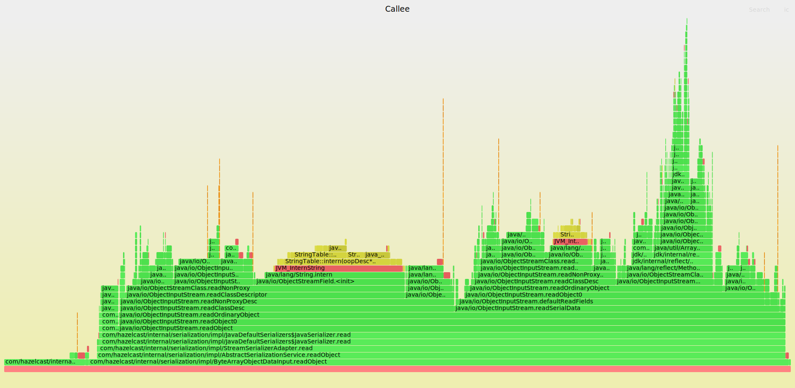
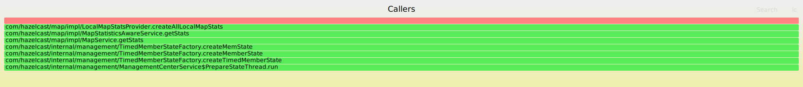

# collapsed-stack-viewer
Viewer for collapsed stack output of profiles. Dedicated to async-profiler.

## How to install - from binaries
Simply download latest release from `https://github.com/krzysztofslusarski/collapsed-stack-viewer/releases`.

## How to install - from sources
```shell script
git clone --depth 1 https://github.com/krzysztofslusarski/collapsed-stack-viewer.git
cd collapsed-stack-viewer/
mvn clean package
```

JAVA_HOME should point to JDK 11.

## How to run
`java -jar collapsed-stack-viewer.jar`

Java should point to JDK 11. After you run it, viewer is available on `http://localhost:8079/`.

## How to configure
Viewer is Spring Boot application, you can create `application.yml` with:

```yaml
server:
  port: 8079 
```

## Example usage od async-profiler
`
./profiler -t -d 30 -e cpu -o collapsed -f output.txt <pid>
`

* `-t` - gives you output divided by thread
* `-d 30` - 30s duration
* `-e cpu` - profiled event, viewer should work with every event
* `-o collapsed` - as name suggest, this is collapsed stack viewer, so this is mandatory output
* `-f output.txt ` - output file
* `<pid>` - pid of your JVM

## Features of collapsed-stack-viewer
### Analysis of 1 file
#### Flame graphs


Viewer can generate flame graphs:
* **Flame graph** - common flame graph from your collapsed stack file
* **Flame graph with no thread division** - common flame graph with division by thread removed
* **Hotspot flame graph** - flame graph that is inverted and reversed, presenting hotspots from collapsed stack file:
  *  **depth = 10/20/30** - shortened graph with smaller stacks

#### Method total time


Total time is number of stacks, that method was anywhere on the stack. Method name can be filtered.    

#### Method self time


Self time is number of stacks, that method was at the end of the stack. Method name can be filtered.      

#### Callee and callers flame graphs for methods


Callee graph shows what method is actually doing. This graph is aggregated, so it shows every usage of method.



Callers graph shows what which method used profiled method. This graph is aggregated, so it shows every usage of method.

### Compare 2 files

Viewer can compare two files, it will present 
* Method total/self time tables:
  * Methods not found in the 1st file
  * Methods not found in the 2nd file
  * Methods that used more resources in the 1st file then in the 2nd file
  * Methods that used more resources in the 2nd file then in the 1st file
  * Methods that used the same amount of resources
