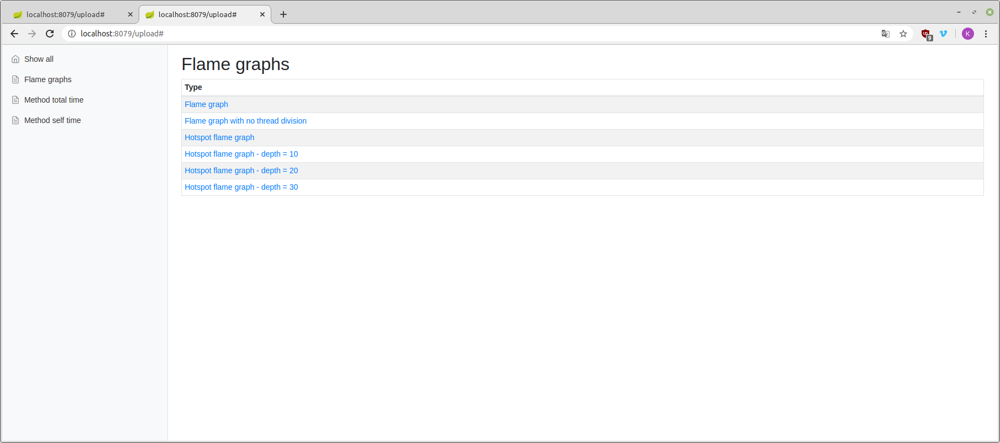
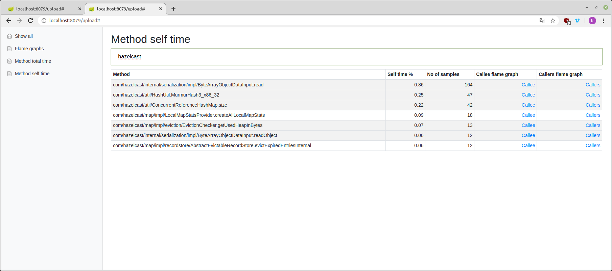
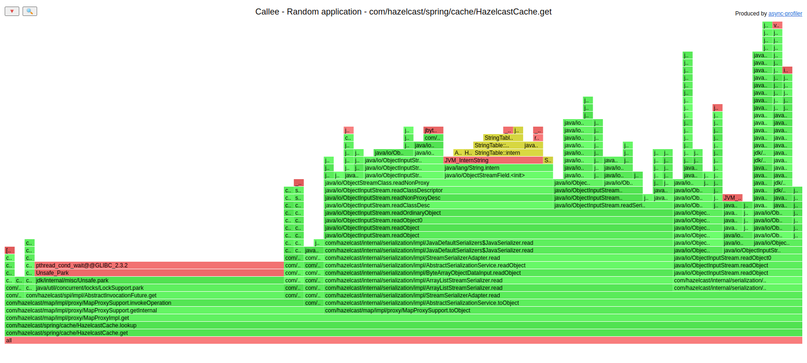
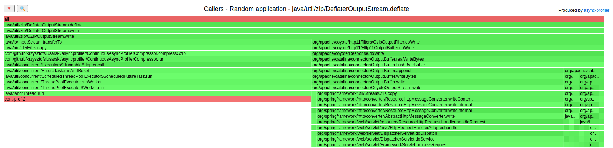
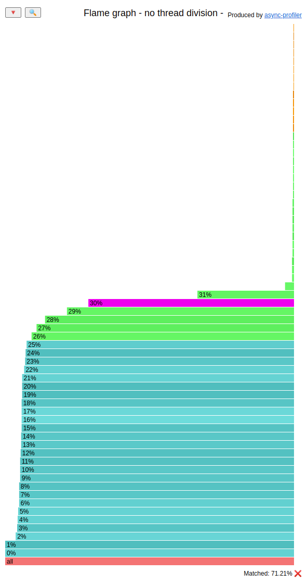

# JVM profiling toolkit
Viewer for collapsed stack and JFR outputs of profiles. Dedicated to Async-profiler 2.x, but
works also with Async-profiler 1.x and Java Flight Recorder.

## ECID functionality

To benefit from filters with ECID you need to use precompiled Async-profiler from
[PR](https://github.com/jvm-profiling-tools/async-profiler/pull/576), and make use of a new API created there.
## How to install - from sources
```shell script
git clone --depth 1 https://github.com/krzysztofslusarski/jvm-profiling-toolkit.git
cd jvm-profiling-toolkit/
mvn clean package
```

JAVA_HOME should point to JDK 11.

## How to run
`java -jar viewer-application/target/viewer-application.jar`

Java should point to JDK 11. After you run it, viewer is available on `http://localhost:8079/`.

## How to configure
Viewer is Spring Boot application, you can create `application.yml` with:

```yaml
server:
  port: 8079 
```

## Example usage od Async-profiler for collapsed stack
`
./profiler -t -d 30 -e cpu -o collapsed -f output.txt <pid>
`

* `-t` - gives you output divided by thread
* `-d 30` - 30s duration
* `-e cpu` - profiled event, viewer should work with every event
* `-o collapsed` - as name suggest, this is collapsed stack viewer, so this is mandatory output
* `-f output.txt ` - output file
* `<pid>` - pid of your JVM

## Features of viewer
### Analysis of collapsed stack file
#### Flame graphs


Viewer can generate flame graphs:
* **Flame graph** - common flame graph from your collapsed stack file
* **Flame graph with no thread division** - common flame graph with division by thread removed
* **Hotspot flame graph** - flame graph that is inverted and reversed, presenting hotspots from collapsed stack file:
  *  **depth = 10/20/30** - shortened graph with smaller stacks

#### Method total time


Total time is number of stacks, that method was anywhere on the stack. Method name can be filtered.    

#### Method self time


Self time is number of stacks, that method was at the end of the stack. Method name can be filtered.      

#### Callee and callers flame graphs for methods


Callee graph shows what method is actually doing. This graph is aggregated, so it shows every usage of method.



Callers graph shows what which method used profiled method. This graph is aggregated, so it shows every usage of method.

### Analysis of JFR files

You can add filters to your parser:
* Thread filter
* Access log style filter - end date and duration (in milliseconds)
* Warmup / cooldown filter - this one skips proper number of seconds from the beginning and the end

#### Collapsed stack files

You can upload multiple JFR files with a single HTTP POST to the analyzer. Analyzer creates following 
collapsed stack from your JFR file:
* Wall-clock - if you used Async-profiler in ```wall``` mode only
* CPU - if you used Async-profiler in ```wall``` mode the CPU file is made from ```wall``` output with 
  stacks that were consuming CPU only
* Heap allocation (count) - if you used ```alloc``` mode - this one presents count of allocations that
  needed new TLAB or needed allocation outside TLAB 
* Heap allocation (size) - if you used ```alloc``` mode - this one presents size of allocations mentioned
  above
* Locks - if you used ```lock``` mode
* CPU load
  * JVM system
  * JVM user
  * JVM total
  * Machine total
  * Machine total - JVM total 

##### CPU usage flame graphs



On example above you can see that the CPU (this one is JVM total) consumed at least **30%** of the CPU 
for **71,21%** of time.

#### Other JFR information

JFR viewer will also show you:
* OS Info
* CPU Info
* Initial system properties
* JVM Info

If you upload multiple files then last information parsed is present in those sections.
