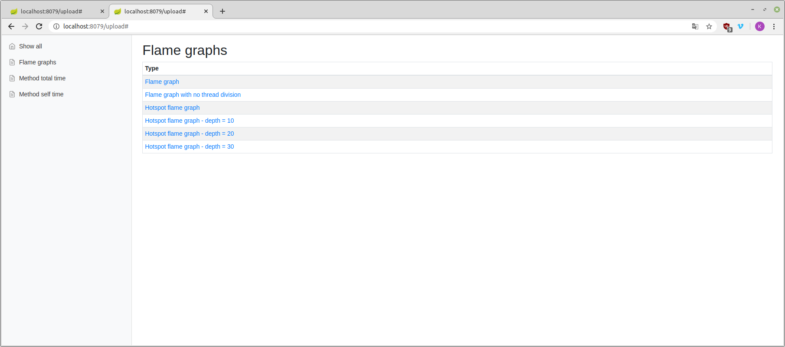
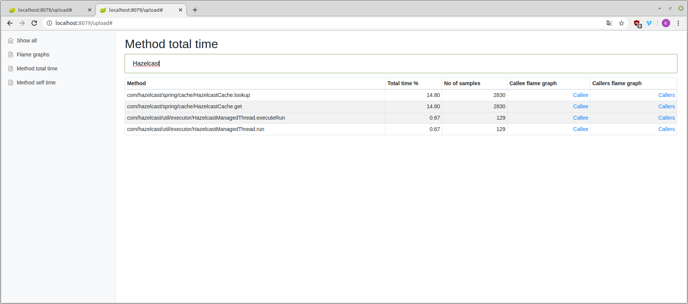
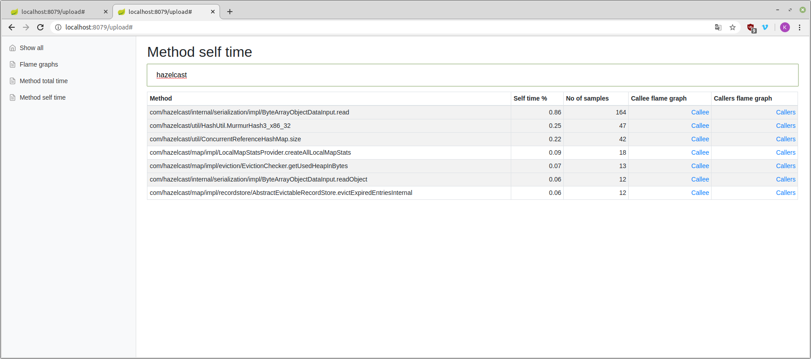
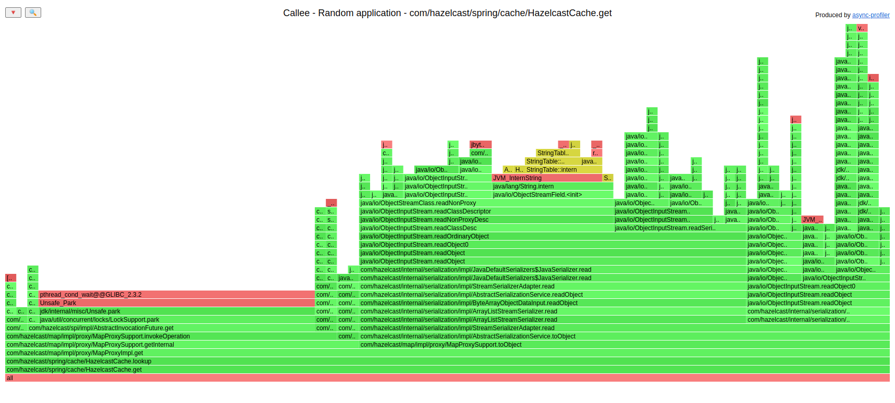
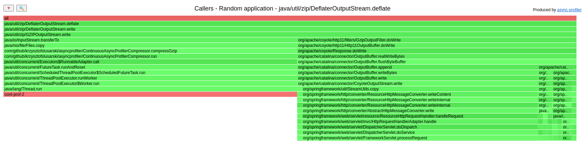

# JVM profiling toolkit
Viewer for collapsed stack and JFR outputs of profiles. Dedicated to Async-profiler 2.x, but
works also with Async-profiler 1.x and Java Flight Recorder.

JAVA_HOME should point to JDK 17.

## How to install - from sources
```shell script
git clone --depth 1 https://github.com/krzysztofslusarski/jvm-profiling-toolkit.git
cd jvm-profiling-toolkit/
mvn clean package
```

## How to run
`java -jar viewer-application/target/viewer-application.jar`

Java should point to JDK 11. After you run it, viewer is available on `http://localhost:8079/`.

## How to configure
Viewer is Spring Boot application, you can create `application.yml` with:

```yaml
server:
  port: 8079 
```

## Console viewer
If you cannot (or do not want to) open a browser, there is a full screen console viewer for JFR files:

```shell script
java -jar cli-application/target/jfr-cli.jar [options] <file.jfr> [<file.jfr> ...]
```

It gives you the same four pages as the web viewer - flame graph, total time table, self time table and
span stats - computed by exactly the same code. Only JFR files are supported, collapsed stack files are not.

Parsing options, the counterparts of the checkboxes on the upload page:

* `--old-async-profiler` - files were recorded with Async-profiler older than 2.9
* `--wall-clock-exact-time` - use the exact time of wall-clock samples
* `--unify-lambdas` - merge lambda classes differing only by their generated suffix
* `--cross-file-span-matching` - match spans with events recorded in the other files
* `--throw-on-errored-file` - fail instead of skipping a file that cannot be parsed
* `--table-limit=<rows>` - maximum number of rows in the tables, `10000` by default

A console is too narrow for a sidebar, so every filter and option lives behind a shortcut:

| Key           | Action                                                                    |
|---------------|---------------------------------------------------------------------------|
| `1` .. `4`    | flame graph / total time / self time / span stats                          |
| `e`           | event: execution, wall-clock, allocation (count, size), lock (count, time)  |
| `f`           | filters: thread, stack trace, span, time, consumes CPU                      |
| `l`           | additional levels of the flame graph                                        |
| `o`           | options: table limit, reverse flame graph                                   |
| `r` or `F5`   | reload the page with the current settings                                   |
| `/`           | highlight frames (flame graph) or filter rows (tables)                      |
| `x`           | export the current flame graph as an interactive HTML file                  |
| `?` or `F1`   | list of all shortcuts                                                       |
| `q`           | quit                                                                        |

The flame graph is drawn like the HTML one - it grows upwards from `all` at the bottom, and turns into an
icicle hanging from the top when the stacks are reversed. Arrows move between frames in the direction they
are drawn, `Enter` zooms into the selected frame, `Backspace` zooms out and `Home` resets the zoom. Frames
are coloured exactly like in the HTML flame graphs.

## Example usage od Async-profiler for collapsed stack
`
./profiler -t -d 30 -e cpu -o collapsed -f output.txt <pid>
`

* `-t` - gives you output divided by thread
* `-d 30` - 30s duration
* `-e cpu` - profiled event, viewer should work with every event
* `-o collapsed` - as name suggest, this is collapsed stack viewer, so this is mandatory output
* `-f output.txt ` - output file
* `<pid>` - pid of your JVM

## Features of viewer
### Analysis of collapsed stack file
#### Flame graphs


Viewer can generate flame graphs:
* **Flame graph** - common flame graph from your collapsed stack file
* **Flame graph with no thread division** - common flame graph with division by thread removed
* **Hotspot flame graph** - flame graph that is inverted and reversed, presenting hotspots from collapsed stack file:
  *  **depth = 10/20/30** - shortened graph with smaller stacks

#### Method total time


Total time is number of stacks, that method was anywhere on the stack. Method name can be filtered.    

#### Method self time


Self time is number of stacks, that method was at the end of the stack. Method name can be filtered.      

#### Callee and callers flame graphs for methods


Callee graph shows what method is actually doing. This graph is aggregated, so it shows every usage of method.



Callers graph shows what which method used profiled method. This graph is aggregated, so it shows every usage of method.

### Analysis of JFR files

You can add filters to your parser:
* Thread filter
* Access log style filter - end date and duration (in milliseconds)
* Warmup / cooldown filter - this one skips proper number of seconds from the beginning and the end

#### Collapsed stack files

You can upload multiple JFR files with a single HTTP POST to the analyzer. Analyzer creates following 
collapsed stack from your JFR file:
* Wall-clock - if you used Async-profiler in ```wall``` mode only
* CPU - if you used Async-profiler in ```wall``` mode the CPU file is made from ```wall``` output with 
  stacks that were consuming CPU only
* Heap allocation (count) - if you used ```alloc``` mode - this one presents count of allocations that
  needed new TLAB or needed allocation outside TLAB 
* Heap allocation (size) - if you used ```alloc``` mode - this one presents size of allocations mentioned
  above
* Locks - if you used ```lock``` mode
* CPU load
  * JVM system
  * JVM user
  * JVM total
  * Machine total
  * Machine total - JVM total 

#### Other JFR information

JFR viewer will also show you:
* OS Info
* CPU Info
* Initial system properties
* JVM Info

If you upload multiple files then last information parsed is present in those sections.
